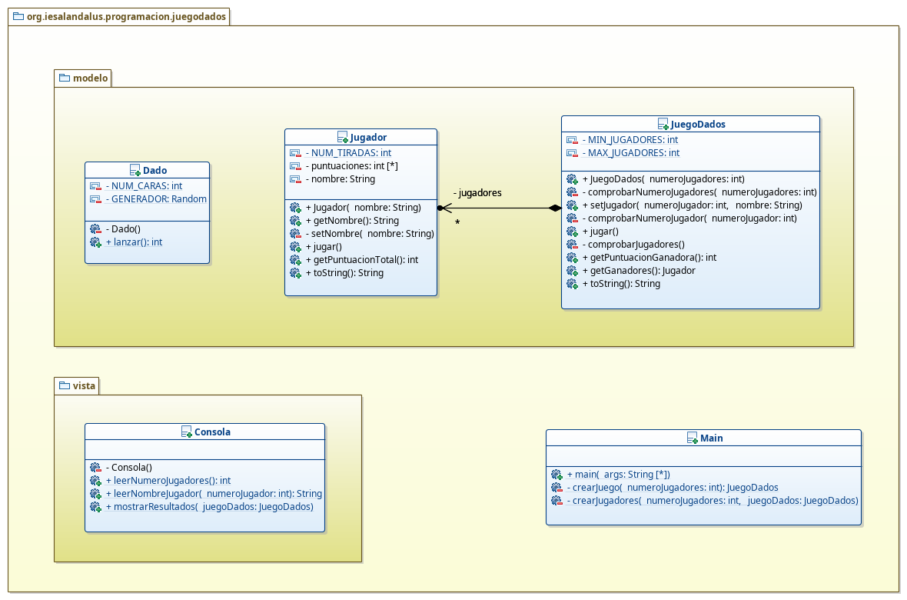

# Juego de dados
## José Ramón Jiménez Reyes

Debes crear un programa en java que simule un juego de dados. El juego de dados consiste en que entre 2 y 10 jugadores lanzarán un dado 5 veces y ganará o ganarán los que su puntuación haya sido la más alta.

- Un dado simplemente se podrá lanzar y en su lanzamiento devolverá un número entero entre 1 y 6, ambos inclusive.
- Un jugador tendrá un nombre que no puede estar vacío, sabrá jugar (es decir, sabrá lanzar el dado 5 veces), llevará apuntado el resultado de cada tirada y sabrá sumar sus tiradas para mostrar su puntuación total obtenida. Además, un jugador se mostrará indicando su nombre, sus tiradas y su puntuación total.
- El juego de dados tendrá un conjunto de jugadores entre 2 y 10, se podrá jugar, lo que hará que cada jugador comience el juego y será capaz de informar de la puntuación ganadora y de los jugadores que han obtenido dicha puntuación. Un juego de dados se representa, representando cada uno de los jugadores (su nombre, tiradas y puntuación total).
- El programa principal preguntará cuántos jugadores quieren jugar, leerá los nombres de cada uno de los jugadores, comenzará la partida y mostrará los resultados (jugadores, puntuación ganadora y nombre de los ganadores). Para ello debes implementar el diseño que se expone en el siguiente diagrama de clases:

Las tareas que debes realizar son las siguientes:
- Crea la clase `Dado` cons las constantes que se indican y que debe tener un método de clase llamado `lanzar` que devolverá un número aleatorio entre 1 y 6. Debes evitar que se puedan crear objetos de esta clase.
- Crea la clase `Jugador` con las constantes y atributos que se especifican en el diagrama de clases y los diferentes métodos con su visibilidad adecuada. En el constructor se debe llamar al método privado `setNombre` que deberá comprobar si el nombre es adecuado y si no lanzar una excepción informando del error. El método `jugar` lanzará 5 veces el dado y apuntará cada tirada en el elemento del array correspondiente. El método `getPuntuacionTotal` devolverá la suma de la puntuación obtenida en las 5 tiradas. El método `toString` devolverá el nombre del jugador, la puntuación obtenida en cada una de las tiradas y la puntuación total.
- Crea la clase `JuegoDados` con las constantes y atributos que se especifican en el diagrama de clases y los diferentes métodos con su visibilidad adecuada. El constructor debe comprobar si el número de jugadores es válido y de lo contrario lanzar una excepción informando del error. El método `setJugador` modificará el jugador que se encuentre en el índice indicado siempre que sea correcto o de lo contrario lanzará una excepción informando del error. El método `jugar` le dirá a cada uno de los jugadores que juegue. El método `getPuntuacionGanadora` mostrará la puntuación ganadora entre todos los jugadores. El método `getGanadores` devolverá los jugadores que tengan una puntuación igual a la puntuación ganadora. El método `toString` devolverá cada uno de los jugadores (con su nombre, tiradas y puntuación total).
- Crea la clase `Consola` que será una clase de utilidades por lo que debes evitar que se puedan crear objetos de la misma. Crea el método `leerNumeroJugadores` que mostrará un mensaje pidiendo el número de jugadores y devolverá el entero leído. Crea el método `leerNombreJugador` que mostrará un mensaje pidiendo el nombre del jugaodr que se le pasa por parámetro y devolverá el nombre leído (el nombre no puede se blanco o estar vacío). Crea el método `mostrarResultado` que recibirá como parámetro un juego de dados y mostrará los jugadores, la puntuación ganadora y el nombre o los nombres de los ganadores.
- Crea la clase `Main` tal y com se especifica en el diagrama de clases. El método `main` deberá leer el número de jugadores que van a jugar e intentar crear el juego. Si al crear el juego el número de jugadores no es correcto se deberá volver a intentar leer el número de jugadores y crear el juego hasta que se cree correctamente. Una vez creado el juego, se jugará al mismo y se mostrarán los resultados.

Una posible salida sería la que se muestra a continuación:
~~~
Juego de dados.
---------------

Introduce el número de jugadores: 5
Introduce el nombre del jugador 1: Pedro
Introduce el nombre del jugador 2: Inés
Introduce el nombre del jugador 3: José
Introduce el nombre del jugador 4: Ana
Introduce el nombre del jugador 5: Manuel
Resultados del juego.
---------------------
Puntuación de los jugadores: 
Jugador [nombre=Pedro, puntuaciones=[1, 3, 5, 5, 6], puntuación total=20]
Jugador [nombre=Inés, puntuaciones=[1, 3, 1, 4, 6], puntuación total=15]
Jugador [nombre=José, puntuaciones=[6, 4, 4, 6, 4], puntuación total=24]
Jugador [nombre=Ana, puntuaciones=[5, 4, 5, 4, 6], puntuación total=24]
Jugador [nombre=Manuel, puntuaciones=[2, 2, 4, 2, 4], puntuación total=14]
Puntuación máxima: 24
Ganadores: José, Ana
~~~
